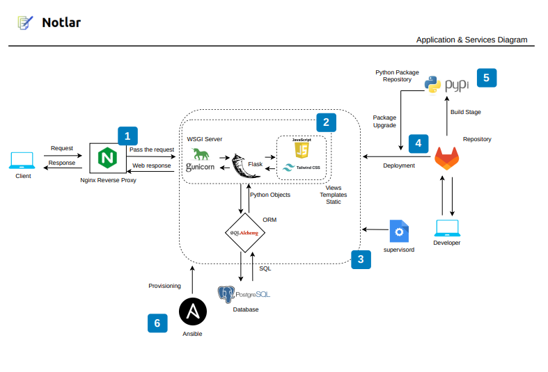

# 

- [Proyect Certificate of Higher Education - Higher Technician in Development of Web Applications](https://todofp.es/dam/jcr:7c3d42db-83bf-4abb-9d81-cd4f41fe1a1a/n-tsdesarrolloaplicacionesweben-pdf.pdf)

Notlar is a Flask web application for note management. It allows users to create and delete notes based on dates using a dynamic calendar.

The frontend utilizes tailwindcss, a CSS framework that, despite having a somewhat steep learning curve initially, enables rapid component creation and streamlines development. The flowbite plugin has also been incorporated.

The application is multilingual, leveraging the Flask-Babel module as a Flask extension to provide i18n support for using different languages in the application.

PostgreSQL serves as the database backend.

The application relies heavily on JavaScript. Due to interactions with calendars and notes, numerous listeners, functions fetching various endpoints, etc., have been added.

Flask employs a template system based on Jinja. This facilitates development and reduces the amount of repeated code. For instance, in notlar/templates/head.html, styles for tailwind, the flowbite module, jQuery, and in notlar/templates/base.html, other templates, including the head, are included. Then, in other templates, the base is included, eliminating the need to write the entire header, navigation, footer, among others, in each and every available template. This ensures better code division.

## How to Run Notlar

The entire environment can be set up using Docker compose. Ensure that Docker and Docker Compose are installed.

1. Clone the repository where your project is located:

```bash
$ git clone https://gitlab.iessanclemente.net/dawd/a23adrianfa.git
$ cd notlar
```

2. Build and start the infrastructure with Docker:


```bash
$ docker-compose up --build
```

This will create the image specified in Dockerfile that houses our Flask backend and install all dependencies.

Three Docker containers will be running:

- One with Flask running with gunicorn (a WSGI HTTP server for running Python web applications), providing improved security and performance compared to Flask's default web server.
- One with PostgreSQL serving as our database.
- One with Nginx acting as a reverse proxy to handle requests. This is a good practice as Nginx can provide additional capabilities such as access control rules, restrictions, load balancing, etc.

The first time it runs, a volume for the PostgreSQL Docker will be created, and it will automatically import and execute the notlar.sql file, creating the entire database structure.

Check docker-compose.yml to see that it imports an Nginx configuration file nginx/nginx.conf containing a domain. Modify it according to the desired domain:


```bash
$ sed 's/afusco.eu/mydomain.com/' nginx/nginx.conf
```

If necessary, add the domain to /etc/hosts:

```bash
$ grep afusco.eu /etc/hosts
127.0.0.1 afusco.eu
```

## Development

### Languages

As mentioned earlier, Flask-Babel has been used for the translation system.

The main configuration file is babel.cfg. Here, we define which files to scan for translation:

e.g. If we want to scan all HTML templates, we must add:

```
[jinja2: **/templates/**.html]
```

All words or phrases we want to translate should be in the following format:


```
{{ _('Insert here') }}
```

A Makefile has been created with various targets to automate the process. Run:

```bash
$ make execute_translate
```

This target will:

- Check that pybabel is installed.
- Scan the files defined in babel.cfg and create the main translation template.
- For each language defined in the AVAILABLE_LANGUAGES variable, it will create a folder for that language.

For each language, we will have .po files that we fill with translations, e.g.

```
msgid "Message"
msgstr "Mensaje"
```

Then, running the target again will compile the translations, and we will have the .mo files.


### Database

PostgreSQL can be a bit confusing. We can run queries directly from the CLI without having to access the container, execute SQL statements in psql, etc:


```
$ psql -U notlar -h $(docker inspect -f '{{range.NetworkSettings.Networks}}{{.IPAddress}}{{end}}' notlar_db) -d notlar -c "COPY (SELECT * FROM users) TO STDOUT WITH CSV HEADER"
Password for user notlar:
id,email,username,password,name,last_name,phone_number,telegram_user,profile_picture
25,adri@adri.com,adri@adri.com,pbkdf2:sha256:600000$P15dtIxIEOGyDjYG$8d4e56c4742391647f4e6e9ea6d68e4e887934b13927e0383888c7990547bc07,adrian,fusco,"","",
```

The SQL is located in notlar.sql.

We are using SQLAlchemy as an ORM. Each table in the database is mapped with classes.


### tailwindcss

We are using tailwindcss as a CSS framework. The configuration file is in tailwind.config.js.

If changes, new components, or plugins are added, run the following command:


```bash
$ npx tailwindcss -i ./notlar/static/css/tailwind_input.css -o ./notlar/static/dist/css/output.css
```

This will read the tailwind_input.css file and the tailwind.config.js file, which will scan all the code we have defined in the content for components. If any new components have been added or removed, ./notlar/static/dist/css/output.css will change.

### tox.ini

tox is a way to automate testing in Python-based applications.

In this case, a tox.ini file has been defined that will run the flake8 command (to enforce the Python PEP8 style guide for best practices) and yamllint (which will check YAML files defined for correct syntax).

### CI/CD

In the .gitlab-ci.yml file, there is a corresponding pipeline that will run various stages to assist with development.

### scripts

The scripts folder contains scripts that facilitate different procedures.

### Dependencies

All Flask application dependencies are in the requirements.txt file.


### App Configuration and Credentials

The application's configuration can be found in notlar/init.py.

Here, Flask, Babel, SQLAlchemy, LoginManager are initialized, and the configuration for each of them is defined.

Configuration parameters are defined in a .env file, which contains the application's configuration variables.

### Routes

There are two files where each of the available routes for making requests is managed:

- notlar/auth.py: This file contains routes for login and registration.
- notlar/routes.py: This file contains the remaining routes, including those that load different views (templates) and those that handle requests with notes according to the calendar.

## Deployment

A role has been created in notlar_setup README.MD to automate the deployment. The role automates most of the steps, but it should be noted that it is incomplete. We need to add a .env file in the project's root, and furthermore, enhance the role and add more security measures for production scenarios.

## Package Installation

We can use notlar as a Python module. A setup.py has been added for installation purposes.

We can install our module in a virtual environment.

Create our virtual environment, activate it, install the package, and now we will be able to run our application.

```bash
$ python3 -m venv venv
$ source venv/bin/activate
$ pip install -e .
$ notlar
°2023-12-13 19:22:57 +0100§ °272218§ °INFO§ Starting gunicorn 21.2.0
°2023-12-13 19:22:57 +0100§ °272218§ °INFO§ Listening at: http://0.0.0.0:5000 (272218)
°2023-12-13 19:22:57 +0100§ °272218§ °INFO§ Using worker: sync
°2023-12-13 19:22:57 +0100§ °272222§ °INFO§ Booting worker with pid: 272222
°2023-12-13 19:22:57 +0100§ °272223§ °INFO§ Booting worker with pid: 272223
°2023-12-13 19:22:57 +0100§ °272224§ °INFO§ Booting worker with pid: 272224
°2023-12-13 19:22:57 +0100§ °272225§ °INFO§ Booting worker with pid: 272225
```

## Upload our Package to PyPI

We can upload our package to the Python Package Index PyPI.

```bash
$ python setup.py sdist && twine upload --skip-existing dist/*
```

This will result in something similar to: https://pypi.org/project/notlar/.

## Manifest.in

By default, the application will upload the .py files found within the notlar folder.

If we want to add more files to the package created by setup.py, we can edit our MANIFEST.in.


## supervisord

The application will be executed with supervisord. We will be able to use our program as a service (start, stop, restart, status).

```
# supervisorctl status
notlar                           RUNNING   pid 42810, uptime 0:14:10

# ps -auxxxwwwf | grep notlar
root       39702  0.0  0.2   9604  4224 pts/1    S    13:32   0:00  |                           \_ su notlar
notlar     39703  0.0  0.2   8984  5248 pts/1    S+   13:32   0:00  |                               \_ bash
root       42885  0.0  0.1   7004  2176 pts/3    S+   22:45   0:00                              \_ grep --color=auto notlar
notlar     42810  0.1  3.4  87768 67868 ?        S    22:31   0:01  \_ /home/notlar/venv/bin/python /home/notlar/venv/bin/notlar
notlar     42811  0.0  2.8  87768 56516 ?        S    22:31   0:00      \_ /home/notlar/venv/bin/python /home/notlar/venv/bin/notlar
notlar     42812  0.0  2.8  87768 56516 ?        S    22:31   0:00      \_ /home/notlar/venv/bin/python /home/notlar/venv/bin/notlar
notlar     42813  0.0  2.8  87768 56516 ?        S    22:31   0:00      \_ /home/notlar/venv/bin/python /home/notlar/venv/bin/notlar
notlar     42814  0.0  2.8  87768 56516 ?        S    22:31   0:00      \_ /home/notlar/venv/bin/python /home/notlar/venv/bin/notlar
```

We can see the following tempate to know how it's the configuration of our service:
[supervisord.yml](./ansible/roles/notlar_setup/tasks/supervisord.yml)

## Logo

Application logo created with NameCheap Logo Maker.

## Project Schema



## Licencia

Copyright 2023.

Licensed under the Apache License, Version 2.0 (the "License");
you may not use this file except in compliance with the License.
You may obtain a copy of the License at

    http://www.apache.org/licenses/LICENSE-2.0

Unless required by applicable law or agreed to in writing, software
distributed under the License is distributed on an "AS IS" BASIS,
WITHOUT WARRANTIES OR CONDITIONS OF ANY KIND, either express or implied.
See the License for the specific language governing permissions and
limitations under the License.
